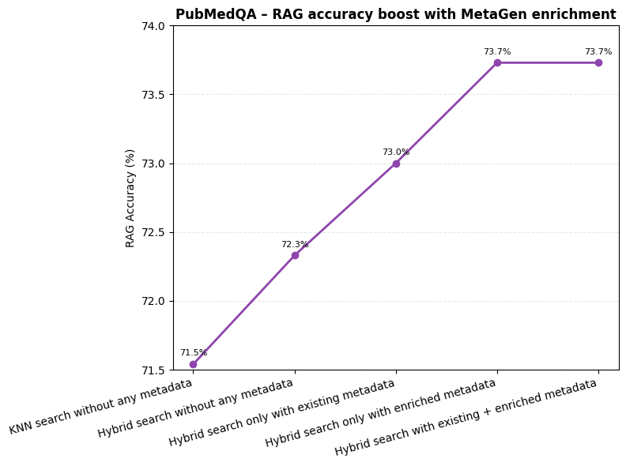

# MetaGen Blended RAG

## Overview

This Git repository hosts the implementation of the MetaGen Blended Retrieval-Augmented Generation (RAG) pipeline, submitted for consideration at the NeurIPS 2025 conference (URL). MetaGen BlendedRAG significantly enhances traditional RAG methods by leveraging structured metadata enrichment to improve retrieval accuracy and the effectiveness of generative responses.

The MetaGen BlendedRAG approach integrates semantic search and hybrid retrieval methods with enriched metadata derived through advanced NLP techniques and large language models (LLMs). By generating comprehensive and precise metadata, this pipeline facilitates more accurate document indexing and retrieval, directly translating to improved downstream performance.

The pipeline workflow includes:

- Data Preprocessing: Understanding dataset-specific metadata characteristics through exploratory analysis.

- Metadata Generation: Enhancing original datasets (PubMedQA, NQ, SQuAD) with metadata enrichment using NLP and LLM-based approaches.

- Indexing and Retrieval: Employing a hybrid retrieval strategy, optimized with BM25 and KNN algorithms within Elasticsearch, leveraging enriched metadata.

- Evaluation: Quantitative evaluation demonstrating retrieval accuracy improvements facilitated by metadata enrichment.

The systematic approach outlined here underscores the robustness and efficacy of MetaGen BlendedRAG in improving both retrieval accuracy and generative model performance.

<p align="center">
  
  <br>
  <em>Figure 1: MetaGen Blended Retrieval-Augmented Generation Pipeline</em>
</p>

## Results
### 1. Reteriver Results 

### Table 1: Retrieval accuracy improvements using MetaGen enrichment across datasets

| Dataset  | Search + Metadata Variant                             | Retrieval Accuracy (%) |
|----------|--------------------------------------------------------|-------------------------|
| PubMedQA | KNN search without any metadata                        | 74.9                    |
| PubMedQA | Hybrid search without any metadata                     | 77.3                    |
| PubMedQA | Hybrid search only with existing metadata              | 78.8                    |
| PubMedQA | Hybrid search only with enriched metadata              | 79.3                    |
| PubMedQA | Hybrid search with existing + enriched metadata        | 79.7                    |
| PubMedQA | Hybrid (boosted) with enriched metadata                | 80.3                    |
| PubMedQA | Hybrid (boosted) with existing metadata                | 80.6                    |
| PubMedQA | Hybrid (boosted) with existing + enriched metadata     | 82.1                    |
| NQ       | Without metadata                                       | 49.99                   |
| NQ       | With existing metadata                                 | 59.49                   |
| NQ       | Existing + enriched metadata                           | 60.48                   |
| SQuAD    | Without metadata                                       | 93.30                   |
| SQuAD    | With existing metadata                                 | 93.58                   |
| SQuAD    | Existing + enriched metadata                           | 93.68                   |


### Table 2: Retrieval accuracy before and after MetaGen enrichment

| Dataset               | Without metadata (%) | After MetaGen enrichment (%) |
|-----------------------|----------------------|-------------------------------|
| PubMedQA              | 74.9                 | 82.1                          |
| Natural Questions (NQ)| 49.99                | 60.48                         |
| SQuAD                 | 93.3                 | 93.68                         |


<p align="center">
  
  <br>
  <em>Figure 2: Impact of Metadata Enrichment on Retrieval Accuracy (PubMedQA dataset)</em>
</p>

### 2. RAG Results

### Table 3: RAG accuracy improvements using MetaGen RAG across datasets

| **Dataset**   | **Search + Metadata Variant**                                | **RAG Accuracy (%)** |
|---------------|--------------------------------------------------------------|-----------------------|
| **PubMedQA**  | KNN search without any metadata                              | 71.5                  |
|               | Hybrid search without any metadata                           | 72.33                 |
|               | Hybrid search only with existing metadata                    | 73.00                 |
|               | Hybrid search only with enriched metadata                    | 73.73                 |
|               | Hybrid search with existing + enriched metadata              | 73.73                 |
|               | Hybrid (boosted) with enriched metadata                      | 73.54                 |
|               | Hybrid (boosted) with existing metadata                      | 74.53                 |
|               | Hybrid (boosted) with existing + enriched metadata           | **77.9**              |
| **NQ**        | Without metadata                                              | 24.77                 |
|               | With existing metadata                                       | 27.42                 |
|               | Existing + enriched metadata                                 | **26.71**             |
| **SQuAD**     | With existing metadata                                       | 57                    |
|               | Existing + enriched metadata                                 | **58.50**             |


<p align="center">
  
  <br>
  <em>Figure 3: Impact of MetaGen Metadata Enrichment on RAG Accuracy (PubMedQA Dataset)</em>
</p>

# Repository Structure
## Code
 ### 1. Data Analysis:
- **NQ-EDA.ipynb**: This script performs data analysis on the NQ dataset.
- **Pubmedqa-EDA.ipynb**: This script performs data analysis on the Pubmedqa dataset..
- **Squad-EDA.ipynb**: This script performs data analysis on the Squad dataset.

 ### 2. Metadata-Gen:
- **NQ-metadata-enrichment.py**: This script is used to generate the metadata for NQ dataset.
- **Pubmedqa_metadata-gen.ipynb**: This script is used to generate the metadata for Pubmedqa dataset.
- **Squad-metadata-gen.ipynb**: This script is used to generate the metadata for Squad dataset.

 ### 3. Indexing:
- **NQ_metadata_indexing.ipynb**: This script indexes the metadata for the NQ dataset.
- **Pubmedqa_metadata_indexing**: This script indexes the metadata for the Pubmedqa dataset.
- **Squad_metadata_indexing**: This script indexes the metadata for the Squad dataset.

### 4. Reteriver-Evaluation:
- **NQ_metadata_indexing.ipynb**: This script evaluates the MetaGen Blended RAG retriever pipeline and generates the results for NQ dataset.
- **Pubmedqa_metadata_indexing.ipynb**: This script evaluates the MetaGen Blended RAG retriever pipeline and generates the results for Pubmedqa dataset.
- **Squad_metadata_indexing.ipynb**: This script evaluates the MetaGen Blended RAG retriever pipeline and generates the results for squad dataset.

### 5. RAG-Evaluation:
- **MetaGen-Blended-RAG-pubMedQA.ipynb**: This script evaluates the MetaGen Blended RAG pipeline and generates the results for pubmedqa dataset.
- **MetaGen-Blended-RAG-Squad.ipynb**: This script evaluates the MetaGen Blended RAG pipeline and generates the results for Squad dataset

## data
- **NQ** -This folder contains the NQ dataset.

## input
This module uses various inputs, such as mapping and search_query, to index and search the queries at the index.
- **mapping/**: Contains sample mapping files with respective BM25, and KNN
- **search_query/**: A collection of search_queries used across different evaluation tasks.

## output
- **nq** -This folder contains the  output of metagen pipeline and reteriver results for NQ dataset.
- **squad** - This folder contains the  output of metagen pipeline and reteriver results for squad dataset.
- **pubmedqa** - This folder contains the  output of metagen pipeline and reteriver results for pubmedqa dataset.

## Prerequisites
Before running the project, ensure you have the following set up:

1. **Elasticsearch Instance**  
   A running instance of Elasticsearch for indexing and searching data.

2. **Watsonx.ai Credentials or LLM Access**  
   Access to IBM Watsonx.ai or any Large Language Model (LLM) provider with valid credentials.

3. **Note**  
    Make sure to add the required values in a `.env` file located in code folder of your project. Each variable should be defined in the format `KEY=VALUE`. For example:
    >
    > ```
    > API_KEY=your_api_key_here
    > BASE_URL=https://your-base-url.com
    > ```
    >
    After setting up the `.env` file, restart your application to ensure the environment variables are loaded correctly.


## Installation
```bash
git clone https://github.com/yourusername/MetaGen-Blended-RAG.git
cd MetaGen-Blended-RAG
pip install -r requirements.txt
```


## Team
- [Kunal Sawarkar](https://github.com/kunal-savvy)
- [Shivam Solanki](https://github.com/biharicoder)
- [Abhilasha Mangal](https://github.com/Abhilasha-Mangal)


## License

This project is licensed under the CC BY 4.0 license - see the [LICENSE](/LICENSE) file for details.
